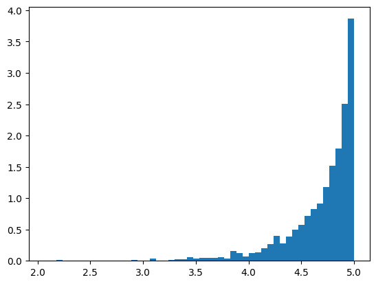
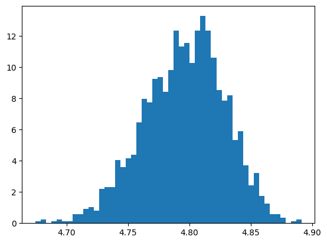

# Comparing star ratings - the Bayesian way

Imagine you want to go to a restaurant and you see the following two ratings
- 5.0 (n = 5)
- 4.8 (n = 500)

How certain can you be that restaurant 1 is the better restaurant?

One complication is that you don't know the actual distribution of stars for restaurant 2, for the first it is obvious.

We will generate a distribution for restaurant 2 which gives us the actual mean of 4.8.

```py
array([ 10,  10,  10,  10, 460])
```

We will use the Multinomial-Dirichlet model to estimate the posterior distribution given a prior and the data. The Dirichlet 
gives us a vector that adds to 1.

Our Dirichlet prior will be the following given we know that many people give 1, 4, or 5 stars. 

```py
alpha = [.25, .125, .125, .25, .25]
```

We use the same prior for both restaurants. We are using `pymc` as our Bayesian engine.

```py
with pm.Model() as model:
  a1 = pm.Dirichlet('a1', alpha)
  a2 = pm.Dirichlet('a2', alpha)
  # likelihood
  y1 = pm.Multinomial('y1', n=5, p=a1, observed=data1)
  y2 = pm.Multinomial('y2', n=500, p=a2, observed=data2)
  trace = pm.sample()
```

The model output is the following, you can see that we have 87% probability of 5 stars for R1 and 92% probability of 5 stars for R2.

```
 	mean 	sd 	hdi_3% 	hdi_97% 	mcse_mean 	mcse_sd 	ess_bulk 	ess_tail 	r_hat
a1[0] 	0.041 	0.077 	0.000 	0.182 	0.002 	0.001 	896.0 	610.0 	1.0
a1[1] 	0.020 	0.052 	0.000 	0.104 	0.001 	0.001 	944.0 	555.0 	1.0
a1[2] 	0.020 	0.055 	0.000 	0.102 	0.001 	0.001 	569.0 	636.0 	1.0
a1[3] 	0.041 	0.074 	0.000 	0.180 	0.002 	0.001 	999.0 	774.0 	1.0
a1[4] 	0.877 	0.123 	0.656 	1.000 	0.003 	0.002 	1802.0 	1343.0 	1.0
a2[0] 	0.021 	0.006 	0.010 	0.032 	0.000 	0.000 	863.0 	1192.0 	1.0
a2[1] 	0.021 	0.006 	0.009 	0.032 	0.000 	0.000 	784.0 	1103.0 	1.0
a2[2] 	0.020 	0.006 	0.010 	0.032 	0.000 	0.000 	858.0 	992.0 	1.0
a2[3] 	0.020 	0.006 	0.010 	0.031 	0.000 	0.000 	919.0 	1053.0 	1.0
a2[4] 	0.919 	0.012 	0.896 	0.940 	0.000 	0.000 	1930.0 	1290.0 	1.0
```

The posterior mean is 4.69 and 4.80 respectively. 

```py
# expected values
a1 = trace.posterior['a1'].mean(axis=(0, 1)).to_numpy()
a2 = trace.posterior['a2'].mean(axis=(0, 1)).to_numpy()
sum(a1 * np.arange(1, 6)), sum(a2 * np.arange(1, 6))
(4.6927501413326596, 4.796011468410374)
```

The probability of less than 4 stars is 8% and 6% respectively. So the chance of a bad experience is higher in the first restaurant.

```py
# prob of a bad experience, (1 2 or 3)
sum(a1[:3]), sum(a2[:3])
(0.08167586791903829, 0.060920351559323675)
```

You can see the posterior distribution of the avg stars for the two restaurants. The 90% intervals are (4.00, 4.99) and (4.74, 4.84) respectively. As expected the interval is much smaller for the restaurant with more reviews.





The code can also be found [here](https://colab.research.google.com/drive/1RJsqxhxqSvHWCNJDsCH3ybVo1RpXpBZ4#scrollTo=8fZq3Gewnmv-)
