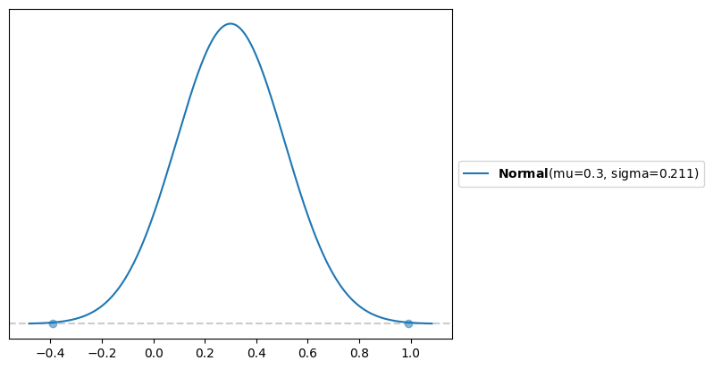
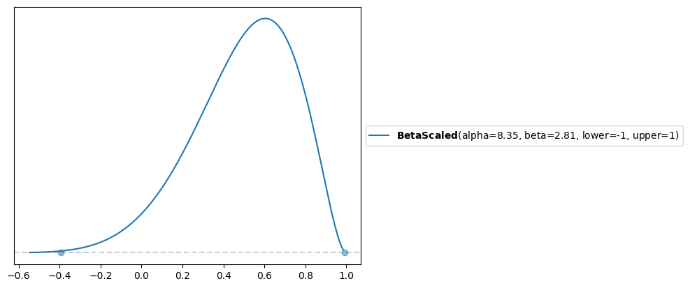

# Inferring correlation from pairs

In this article we briefly look at the **transitivity** of correlation. This means if we know that
pairs (x, y) and (y, z) are positively correlated what can we say about correlation of (x, z).

This is a bit like filling in missing values in a correlation matrix.

It has been proven that

$\rho(x, y) = a$ and $\rho(y, z) = b$

implies

$ab - \sqrt{(1 - a^2)(1 - b^2)} \le \rho(x, z) \le ab + \sqrt{(1 - a^2)(1 - b^2)}$

So we can say what are the lower and upper bounds for the (x, z) correlation.

If we know these bounds can we than overlay a prior distribution to visualise the density of that correlation
estimate.

We will use the `maxent` function in `preliz` to derive this distribution.

Assume we know correlations 0.5 and 0.6 and we want to infer the missing one. The range is (-.39, .99).

```py
a = .6
b = .5
lb = a * b - np.sqrt((1 - a ** 2) * (1 - b ** 2))
ub = a * b + np.sqrt((1 - a ** 2) * (1 - b ** 2))
lb, ub
(-0.39282032302755093, 0.992820323027551)
```

The mid point of that range is 0.3, which is a * b.

If we assume a Normal distribution between the bounds with mass of .999 we get

```py
d = pl.unidimensional.maxent(pl.Normal(), lb, ub, .999)
1 - d[0].cdf(0)
```



which has the expected mean, 92% of the mass is above 0, so we are fairly certain of positive correlation. 

If we assume a `BetaScaled` we get a different shape

```py
d2 = pl.unidimensional.maxent(pl.BetaScaled(lower=-1, upper=1), lb, ub, .999)
d2[0].mean()
1 - d2[0].cdf(0)
```



The mean of it is 0.5, and 96% of the mass > 0.

## Sources

- [video](https://www.youtube.com/watch?v=0d66hPBC38Y)
- [preliz](https://preliz.readthedocs.io/en/latest/)