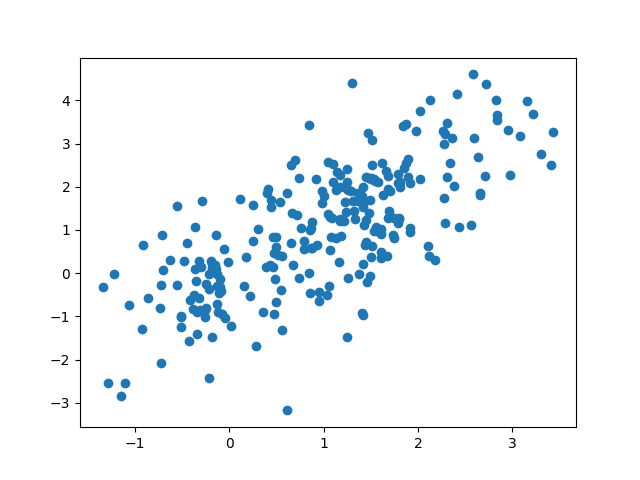

# Hyperparameter optimisation using a keras neural network

Hyperparameter optimisation is a bit of a secret art and not often we see how it's actually done.

In this code example I am using `keras` and `scikit-learn` to optimise a small neural network. 

I am using grid search with cross validation. Initially I was going to use `scikeras` but then found
it doesn't work so well, so I went back to the basics.

My `Regressor` class extends the sklearn `BaseEstimator`, this means it needs a `fit()`, `score()` and `get_params()` method.

My grid search is over 5 parameters with 2 options each, so $2^5$ options in total. 

Keep in mind `GridSearchCV` maximises the score and so I put a negative sign in front of MSE. 


```py
import tensorflow as tf
import numpy as np
from sklearn.model_selection import GridSearchCV
from sklearn.metrics import log_loss, mean_squared_error
# from sklearn.utils.estimator_checks import check_estimator
from sklearn.base import BaseEstimator
import matplotlib.pyplot as plt

# https://scikit-learn.org/stable/developers/develop.html

class Regressor(BaseEstimator):
  def __init__(self, act='relu', hidden=2, lr=.01, epochs=10, batch_size=10):
    self.act = act
    self.hidden = hidden
    self.lr = lr
    self.epochs = epochs
    self.batch_size = batch_size
    self.model = tf.keras.Sequential([
        tf.keras.layers.Dense(self.hidden, activation=act),
        tf.keras.layers.Dense(1, activation='linear')  
    ])
    self.optimizer = tf.keras.optimizers.Adam(learning_rate=lr)
    # self.model.compile(loss='binary_crossentropy', optimizer=self.optimizer)
    self.model.compile(loss='mse', optimizer=self.optimizer)

  def fit(self, X, y):
    self.model.fit(X, y, epochs=self.epochs, batch_size=self.batch_size, verbose=0)

  def predict(self, X):
    return self.model.predict(X)

  def score(self, X, y):
    # grid() maximises by default so we take negative
    # return -log_loss(y, self.model.predict(X, verbose=0))
    error = mean_squared_error(y, self.model.predict(X, verbose=0))
    return - error

  def get_params(self, deep=False):
   return {'act': self.act, 'hidden': self.hidden, 'lr': self.lr, 'epochs': self.epochs, 'batch_size': self.batch_size}


n = 256
X = np.random.normal(0, 1, (n, 2))
y = 1 + X[:, 0] + np.random.normal(0, 1, n)

param_grid = {
    'act': ['relu', 'linear'],
    'hidden': [2, 3],
    'lr': [0.01, 0.1],
    'epochs': [20, 40],
    'batch_size': [16, 32]
}
model = Regressor()
model.fit(X, y)
print(model.score(X, y))

# usin 2 cpu
grid = GridSearchCV(estimator=model, param_grid=param_grid, n_jobs=2, cv=3, verbose=3)
grid_result = grid.fit(X, y)

print(f"Best: {grid_result.best_score_:.4f} using {grid_result.best_params_}")

pred = grid.predict(X)
print(y.mean(), np.mean(pred), mean_squared_error(y, pred))
plt.scatter(pred, y)
plt.savefig('plot.png')

```

Here is the scatter plot of pred vs actual (train and test combined).


